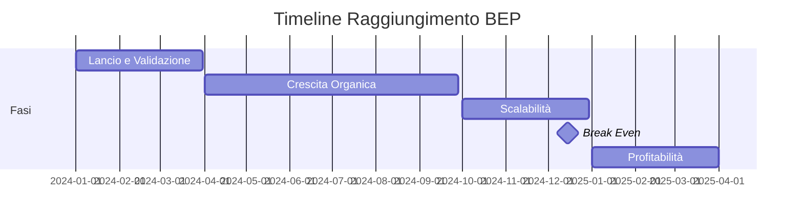

Break Even Point (BEP)
======================
[TOC]

# Introduzione
Il Break Even Point (BEP), o punto di pareggio, è un concetto fondamentale nell'economia e nella finanza aziendale. Rappresenta il livello di vendite o di produzione in cui i ricavi totali sono uguali ai costi totali, ovvero il punto in cui un'azienda non realizza né profitti né perdite. Comprendere il BEP è essenziale per la pianificazione finanziaria e la gestione aziendale, poiché aiuta a determinare il volume minimo di vendite necessario per coprire i costi fissi e variabili.

# Dettagli dei Costi Fissi
I costi fissi sono spese che rimangono costanti indipendentemente dal livello di produzione o vendita. Oltre ai costi del personale e le ore di sviluppo presenti nel Gantt ricordarsi di aggiungere anche i seguenti costi fissi:

- Affitto dei locali, assicurazione (se applicabile)
- Servizi internet, cloud hosting, e altre infrastrutture tecnologiche
- Spese amministrative, legali (commercialista, consulente del lavoro, ecc.)
- Spese di marketing e pubblicità

Questi costi devono essere coperti indipendentemente dal volume di vendite, rendendoli un elemento cruciale nel calcolo del BEP.

# Dettagli dei Costi Variabili
I costi variabili sono spese che variano in proporzione al livello di produzione o vendita. Esempi comuni di costi variabili includono:

- Costi dei servizi cloud o licenze software basate sull'uso
- Costi delle consulenze esterne legate alla produzione o al servizio
- Costo dell'acquisizione del cliente
- Costo marketing diretto, pubblicità pay-per-click
- Commissioni di vendita o costi di transazione associati alle vendite
- Costi di manutenzione e supporto tecnico legati all'uso del prodotto o servizio 

Questi costi aumentano con l'aumentare delle vendite, influenzando direttamente il margine di profitto.

# Calcolo del Break Even Point
Il Break Even Point può essere calcolato utilizzando la seguente formula:

### 1. Margine di Contribuzione Unitario (MC)

$$
\text{MC} = \text{P} - \text{CVU}
$$

*Dove:*
* $\text{P}$ = Prezzo di vendita per unità (es. costo di una licenza mensile)
* $\text{CVU}$ = Costi Variabili Unitari (spese vive per la vendita di un'unità)

---

### 2. Punto di Pareggio in Unità (BEP Unità)

Questa formula calcola il numero di unità (licenze/abbonamenti) che devi vendere per coprire esattamente i tuoi costi fissi.

$$
\text{BEP (Unità)} = \frac{\text{CF}}{\text{MC}}
$$

*Dove:*
* $\text{CF}$ = Costi Fissi Totali (stipendi, affitto, marketing fisso)
* $\text{MC}$ = Margine di Contribuzione Unitario

---

### 3. Punto di Pareggio in Valore Monetario (BEP Valore)

Questa formula calcola il fatturato totale (ricavi) necessario per raggiungere il punto di pareggio.

$$
\text{BEP (Valore)} = \frac{\text{CF}}{\frac{\text{MC}}{\text{P}}} = \frac{\text{Costi Fissi}}{\text{Ratio Margine di Contribuzione}}
$$

*Nota: La $\text{Ratio Margine di Contribuzione}$ (MC/P) è la percentuale di ogni euro di vendita che contribuisce a coprire i costi fissi.*

# Esempio - CloudFlow Solutions
Startup: CloudFlow Solutions
Prodotto: CloudFlow (WebApp SaaS per gestione workflow aziendali)
Modello di business: Abbonamento mensile per utente (licenza)

## 1. Costi Fissi Mensili (CF)
| Voce di Costo | Importo Mensile (€) | Note |
|--------------|-------------------|------|
| **Personale (R&D)** | 6.500 | 1 Full Stack Dev (€3.500) + 1 Junior Dev (€2.000) + 1 UI/UX Designer (€1.000) |
| **Affitto ufficio/coworking** | 600 | Spazio di 40m² in periferia |
| **Server/Cloud Hosting** | 300 | AWS/Azure (server, database, CDN) |
| **Servizi internet/telefonia** | 150 | Fibra + telefoni |
| **Commercialista** | 200 | Consulenza mensile |
| **Software e licenze** | 250 | IDE, Figma, tool di sviluppo |
| **Marketing base (SEO/content)** | 400 | Blog, social media management |
| **Assicurazione RC** | 100 | Responsabilità civile professionale |
| **TOTALE Costi Fissi** | **€ 8.500/mese** | |
**TOTALE Costi Fissi	€ 8.500/mese

## 2. Costi Variabili per Utente (CVU)
| Voce di Costo | Costo per Utente/Mese (€) | Note |
|--------------|-------------------------|------|
| **Supporto tecnico** | 1,50 | Stimato: 15 min/utente/mese × €6/ora |
| **Server risorse aggiuntive** | 0,80 | Storage, banda, CPU per utente attivo |
| **Commissioni transazioni (stripe)** | 0,60 | 3% su €20 (prezzo abbonamento) |
| **Costo acquisizione cliente (CAC)** | 5,00 | Marketing performance (PPC, social ads) |
| **TOTALE CVU** | **€ 7,90** | |

## 3. Prezzi di Vendita (P)
| Piano | Prezzo Mensile (€) | Caratteristiche |
|------|-------------------|-----------------|
| **Basic** | 12,00 | 1 utente, funzionalità base |
| **Professional** | **20,00** | 3 utenti, funzionalità avanzate (target principale) |
| **Enterprise** | 35,00 | 10+ utenti, personalizzazione |

## Calcolo del Break Even Point

### Step 1: Margine di Contribuzione Unitario (MC)
MC = P - CVU
MC = €20,00 - €7,90 = €12,10

### Step 2: Punto di Pareggio in Unità (Numero di Clienti)
BEP (Unità) = Costi Fissi / MC
BEP = €8.500 / €12,10 = 702,48 → 703 clienti

### Step 3: Punto di Pareggio in Valore (Fatturato)
Ratio MC = MC / P = €12,10 / €20,00 = 0,605 (60,5%)

BEP (Valore) = Costi Fissi / Ratio MC
BEP (Valore) = €8.500 / 0,605 = €14.049,59/mese

## Step 4: Analisi di Sensibilità con Mix Clienti
| Scenario | Mix Clienti | Prezzo Medio | MC Medio | BEP (Clienti) |
|----------|-------------|--------------|----------|---------------|
| **Scenario Ottimistico** | 40% Basic, 60% Pro | €16,80 | €8,90 | **955 clienti** |
| **Scenario Base (target)** | 100% Professional | €20,00 | €12,10 | **703 clienti** |
| **Scenario Pessimistico** | 70% Basic, 30% Pro | €14,40 | €6,50 | **1.308 clienti** |

## Piano Operativo per Raggiungere il BEP

### Fase 1: Lancio (Mesi 1-3)
| Elemento | Valore | Note |
|----------|--------|------|
| **Obiettivo clienti** | 100 clienti | 14% del BEP |
| **Investimento marketing** | €3.000/mese | Extra |
| **Costi fissi temporanei** | €11.500/mese | Con marketing aggiuntivo |
| **Nuovo BEP temporaneo** | 950 clienti | |

### Fase 2: Crescita (Mesi 4-9)
| Elemento | Valore | Note |
|----------|--------|------|
| **Obiettivo clienti** | 450 clienti | 64% del BEP |
| **CAC ridotto** | €3,00 | Da bocca-a-bocca |
| **CVU migliorato** | €6,40 | Ottimizzazioni |
| **Nuovo MC** | €13,60 | |
| **Nuovo BEP** | 625 clienti | |

### Fase 3: Scalabilità (Mesi 10-12)
| Elemento | Valore | Note |
|----------|--------|------|
| **Obiettivo clienti** | 703+ clienti | BEP raggiunto |
| **Costi fissi aggiuntivi** | +€2.500 | 1 venditore |
| **Costi fissi finali** | €11.000/mese | |
| **BEP finale** | 909 clienti | |
| **Piano profitti** | €2.900/mese | Con 1.000 clienti |
## Raccomandazioni Strategiche

### 1. Riduzione del BEP (azioni immediate)
| Azione | Impatto | Nuovo BEP | Note |
|--------|---------|-----------|------|
| **Aumento prezzo a €25** | MC = €17,10 | 497 clienti | Rischio di perdita clienti |
| **Riduzione costi fissi a €6.000** | -29,4% costi | 496 clienti | Smart working, outsourcing |
| **Riduzione CVU a €5,90** | MC = €14,10 | 603 clienti | Ottimizzazione infrastruttura |

### 2. Timeline di Raggiungimento BEP

### 3. Metriche di Monitoraggio
| Metrica | Target | Frequenza | Note |
|---------|--------|-----------|------|
| **CAC (Customer Acquisition Cost)** | < €5,00 | Settimanale | Costo acquisizione cliente |
| **LTV (Lifetime Value)** | > €240 | Mensile | Valore vita cliente (12+ mesi) |
| **Churn Rate** | < 5% mensile | Mensile | Tasso di abbandono |
| **MRR (Monthly Recurring Revenue)** | €14.050 | Giornaliero | Fatturato ricorrente mensile |
| **Burn Rate** | €8.500/mese | Mensile | Velocità consumo capitale |

## Analisi di Sensibilità Dettagliata
| Prezzo (€) | MC (€) | BEP (Clienti) | Fatturato BEP (€) | Difficoltà di Vendita |
|------------|--------|---------------|-------------------|----------------------|
| 15,00 | 7,10 | 1.197 | 17.955 | Molto Bassa |
| 18,00 | 10,10 | 841 | 15.138 | Bassa |
| **20,00** | **12,10** | **703** | **14.050** | **Media** |
| 22,00 | 14,10 | 603 | 13.266 | Media-Alta |
| 25,00 | 17,10 | 497 | 12.425 | Alta |

## Variazione Costi Fissi
| Scenario | Costi Fissi (€) | BEP (Clienti) | Capitale Necessario (12 mesi) |
|----------|-----------------|---------------|-----------------------------|
| **Minimalista** | 6.000 | 496 | €72.000 |
| **Efficiente** | 7.500 | 620 | €90.000 |
| **Base** | 8.500 | 703 | €102.000 |
| **Completo** | 10.000 | 826 | €120.000 |
| **Espansivo** | 12.000 | 992 | €144.000 |

## Piano Finanziario 12 Mesi
| Mese | Clienti Target | MRR (€) | Costi Totali (€) | Profitto/Perdita (€) | Cumulativo (€) |
|------|----------------|---------|------------------|----------------------|----------------|
| 1 | 20 | 400 | 11.500 | -11.100 | -11.100 |
| 2 | 50 | 1.000 | 11.500 | -10.500 | -21.600 |
| 3 | 100 | 2.000 | 11.500 | -9.500 | -31.100 |
| 4 | 180 | 3.600 | 9.500 | -5.900 | -37.000 |
| 5 | 270 | 5.400 | 9.500 | -4.100 | -41.100 |
| 6 | 370 | 7.400 | 9.500 | -2.100 | -43.200 |
| 7 | 480 | 9.600 | 9.500 | 100 | -43.100 |
| 8 | 560 | 11.200 | 9.500 | 1.700 | -41.400 |
| 9 | 630 | 12.600 | 9.500 | 3.100 | -38.300 |
| 10 | 700 | 14.000 | 11.000 | 3.000 | -35.300 |
| 11 | 750 | 15.000 | 11.000 | 4.000 | -31.300 |
| 12 | **820** | **16.400** | **11.000** | **5.400** | **-25.900** |

## Sintesi Investimento
| Concetto | Valore |
|----------|--------|
| **Capitale iniziale necessario** | €102.000 (12 mesi) |
| **Break Even Point** | 703 clienti / €14.050 MRR |
| **Tempo stimato al BEP** | 10-12 mesi |
| **Profitto mensile a 1.000 clienti** | €2.900 (3,5% margine) |
| **ROI dopo 24 mesi** | 15-20% |

Riduzione CAC: Ottimizzare marketing per CAC < €4

Estensione LTV: Implementare strategie retention > 18 mesi

Scalabilità tecnica: Architettura pronta per 1.000+ utenti concorrenti

Finanziamento: Garantire almeno €120.000 per 14 mesi di runway
