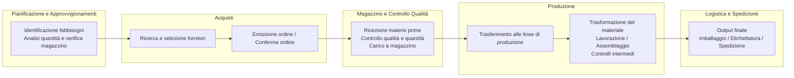

Economy & Finance
=================
[TOC]

v0.0.1 25-11-2025

# Impresa Vs Azienda

### Impresa

**È l’attività svolta dall’imprenditore**. Consiste nello svolgimento organizzato di un’attività economica con lo scopo di produrre o scambiare beni o servizi.L’impresa è quindi un processo, un’azione continuativa.

*Base normativa: art. 2082 del Codice Civile*

**Esempio:** “L’impresa di Mario produce scarpe” > Qui si parla dell’attività economica svolta.

### Azienda

**È il complesso dei beni organizzati dall’imprenditore per l’esercizio dell’impresa**. Include quindi macchinari, negozi, brevetti, arredi, marchio, software, ecc.

*Base normativa: art. 2555 del Codice Civile*

**Esempio:** “L’azienda di Mario comprende un capannone, macchinari e il marchio”.

### In sintesi

| Termine   | Cosa indica                           | Natura                |
|-----------|----------------------------------------|------------------------|
| **Impresa** | L’attività economica                  | **Azione / processo**  |
| **Azienda** | I beni utilizzati per svolgere l’impresa | **Cosa / struttura** |

Impresa = attività
Azienda = struttura di beni usata per svolgerla

### Esempio reale: Microsoft

- **Impresa Microsoft**
  È l’attività economica che consiste nello sviluppare, vendere e distribuire software, sistemi operativi, servizi cloud e prodotti hardware.

- **Azienda Microsoft**
  È l'insieme dei beni organizzati per svolgere l’attività:
  - Data center Azure
  - Uffici e campus (come quello di Redmond)
  - Codice sorgente dei software
  - Brevetti e marchi (es. Windows, Office)
  - Server, infrastrutture, dispositivi di test
  - Risorse digitali e piattaforme tecnologiche

### Mini-mappa: Differenza tra Impresa e Azienda

- **Impresa**
  - Attività economica
  - Organizzata e continuativa
  - Scopo: produrre/scambiare beni o servizi
  - → È un *processo*

- **Azienda**
  - Insieme di beni organizzati
  - Materiali: macchinari, uffici, strumenti
  - Immateriali: marchi, brevetti, software
  - → È una *struttura*

- **Relazione**
  - L'impresa usa l’azienda per svolgere l’attività
  - Senza impresa → azienda non ha funzione economica
  - Senza azienda → impresa non può operare

    

# Tipi di Aziende e Imprese

### Tipi di Aziende
Le Aziende si classificano in base alla loro funzione economica ed al fine. Per **funzione economica** si distinguono in:
- Aziende di Produzione: Producono beni o servizi (es. fabbriche, software house)
- Aziende di Erogazione: Offrono servizi alla collettività senza scopo di lucro (es. ospedali pubblici, scuole statali)
- Aziende di Consumo: Famiglie, che utilizzano beni e servizi per soddisfare i propri bisogni
- Aziende di Distribuzione: Si occupano della commercializzazione e distribuzione di beni (es. supermercati, catene di negozi, eCommerce)

Per **fine** si distinguono in:
- Aziende Lucrative: Obiettivo di massimizzare il profitto (es. imprese private)
- Aziende Mutualistiche: Obiettivo di soddisfare bisogni sociali o vantaggi ai soci (es. cooperative, associazioni)
- Aziende Pubbliche: Gestite dallo Stato o enti pubblici, con finalità di interesse collettivo (es. poste, ferrovie)
- Aziende No Profit: Non hanno scopo di lucro, ma operano per finalità sociali, culturali o umanitarie (es. ONG, fondazioni)

### Tipi di Imprese
Le Imprese si classificano in base a diversi criteri:

Dimensione:
- Microimprese: meno di 10 dipendenti e fatturato annuo o bilancio ≤ 2 milioni €
- Piccole imprese: meno di 50 dipendenti e fatturato annuo o bilancio ≤ 10 milioni €
- Medie imprese: meno di 250 dipendenti e fatturato annuo ≤ 50 milioni € o bilancio ≤ 43 milioni €
- Grandi imprese: più di 250 dipendenti o fatturato annuo > 50 milioni € o bilancio > 43 milioni €

Settore:
- Primario(Imprese agricole): coltivazione e allevamento (es. aziende agricole, fattorie) 
- Secondario(Imprese industriali): produzione di beni materiali (es. fabbriche, manifattura)
- Terziario (Imprese commerciali): compravendita di beni (es. negozi, catene di distribuzione)
- Terziario Avanzato (Imprese di servizi): offerta di servizi (es. banche, assicurazioni, consulenze)

Forma giuridica:
- Imprese individuali: gestite da un singolo imprenditore (es. artigiani, commercianti)
- Società di persone: costituite da più soci con responsabilità illimitata (es. società in nome collettivo - SNC, società in accomandita semplice - SAS)
- Società di capitali: costituite da soci con responsabilità limitata al capitale investito (es. società per azioni - SPA, società a responsabilità limitata - SRL)
- Cooperative: imprese mutualistiche gestite dai soci per scopi comuni (es. cooperative di consumo, cooperative agricole)

Proprietà:
- Imprese private: di proprietà di privati o azionisti (es. aziende commerciali, industrie)
- Imprese pubbliche: di proprietà dello Stato o enti pubblici (es. aziende di trasporto pubblico, servizi idrici)
- Imprese miste: partecipazione sia pubblica che privata (es. aziende energetiche, telecomunicazioni) 

Ambito geografico:
- Imprese locali: operano in un'area geografica limitata (es. negozi di quartiere, artigiani)
- Imprese nazionali: operano a livello nazionale (es. catene di supermercati, aziende di trasporto)
- Imprese internazionali: operano in più paesi (es. multinazionali, aziende di esportazione)
- Imprese globali: operano a livello mondiale con presenza in molti paesi (es. grandi multinazionali come Apple, Coca-Cola)

Attiività economica:
- Imprese di produzione: creano beni materiali (es. fabbriche, industrie manifatturiere)
- Imprese di servizi: offrono servizi (es. banche, compagnie assicurative, consulenze)
- Imprese commerciali: si occupano di compravendita (es. negozi, catene di distribuzione)
- Imprese agricole: coltivano e allevano (es. aziende agricole, fattorie)
- Imprese artigianali: producono beni in modo manuale o con tecniche tradizionali (es. laboratori artigiani, botteghe)
- Imprese digitali: operano principalmente online (es. eCommerce, piattaforme digitali)

  

# Capitale di Rischio Vs Capitale di Debito

### Capitale di rischio

È il capitale proprio dell’impresa, apportato dai soci o dagli azionisti.

Caratteristiche:
- Proprietà dell’impresa > gli investitori diventano soci
- Rimborso non garantito; i soci vengono rimborsati solo alla fine (in caso di liquidazione) e solo se restano risorse
- Remunerazione: tramite dividendi, solo se ci sono utili
- **Rischio: alto, perché i soci sopportano le perdite**
- Controllo: conferisce diritti di voto e potere decisionale

Esempi:
- Capitale sociale
- Aumenti di capitale
- Utili reinvestiti (autofinanziamento)

### Capitale di debito

È il capitale preso in prestito da terzi

Caratteristiche:
- Non dà proprietà > i finanziatori NON diventano soci
- Rimborso: obbligatorio a scadenza, indipendentemente dagli utili
- Remunerazione: interessi, che l’impresa deve pagare anche se è in perdita
- Rischio: più basso per chi presta > hanno diritto di **essere pagati prima dei soci**
- Controllo: nessun diritto di voto, ma possono esserci vincoli (covenants)

Esempi:
- Prestiti bancari
- Obbligazioni
- Leasing
- Debiti verso fornitori

**Esempio di Leasing** Un'impresa di costruzioni ottiene un escavatore tramite leasing: una società finanziaria lo compra e lo concede all'impresa, che paga un canone mensile. Alla fine può restituirlo, rinnovare il contratto o acquistarlo pagando un prezzo finale (riscatto)

### In Sintesi

| Tipo di capitale       | Provenienza            | Remunerazione        | Rischio investitore | Diritti        | Rimborso        |
|------------------------|------------------------|-----------------------|----------------------|-----------------|-----------------|
| **Capitale di rischio** | Soci / azionisti       | Dividendi (se utili) | Alto                 | Voto e controllo | Non garantito   |
| **Capitale di debito**  | Banche / terzi         | Interessi            | Basso                | 
Nessun voto      | Obbligatorio    |

  

# Microstruttura e Macrostruttura Aziendale

### Microstruttura Aziendale
Nella struttura organizzativa di un’azienda, la microstruttura rappresenta il livello più dettagliato dell’organizzazione del lavoro. In essa vengono definiti:

- **Posizione individuale** È il ruolo che una singola persona occupa all’interno dell’organizzazione.
Indica dove il lavoratore si colloca nella gerarchia e a chi deve rispondere (capo diretto).

- **Mansione** È l’insieme delle attività omogenee attribuite a una posizione.
Descrive cosa deve fare in generale il lavoratore (es. “gestione clienti”, “programmazione software”, “contabilità”).

- **Compito** È l’unità di lavoro più piccola: un’azione specifica e concreta da svolgere.
Descrive come si realizza la mansione (es. “registrare una fattura”, “scrivere un modulo in Python”, “rispondere alle email”).

La progettazione organizzativa della microstruttura, pertanto, consiste nel definire il contenuto del lavoro ed il ruolo dei singoli individui all'interno dell'organizzazione, formalizzandone in modo più o meno marcato il comportamento atteso, ed intervenendo dove necessario per sviluppare competenze specifiche.

### Macrostruttura Aziendale
La macrostruttura aziendale rappresenta il livello più ampio e generale dell’organizzazione aziendale. Essa definisce come l’azienda è suddivisa in unità più grandi e come queste unità interagiscono tra loro. Lo strumento che descrive la macrostruttura è l’**organigramma aziendale**, che rappresenta graficamente la gerarchia e le relazioni tra le diverse funzioni e reparti.

La varietà possibile delle forme organizzative è almeno tanto ampia quanto lo è la varietà di combinazioni possibili tra tutti i diversi particolari meccanismi di coordinamento e tutte le particolari modalità di divisione del lavoro e specializzazione (Grandori, 1995). Individuiamo le principali strutture organizzaztive impiegate nelle moderne organizzazioni:

- **Struttura Funzionale:** La struttura funzionale è caratterizzata da un criterio di divisione del lavoro per specializzazioni tecniche. Le attività simili sono raggruppate in unità organizzative separate, ciascuna delle quali è responsabile di una specifica funzione aziendale. Ad esempio, tutte le attività relative alla produzione sono assegnate al reparto di produzione, mentre le attività di marketing sono gestite dal reparto marketing
 **PRO**: specializzazione e competenza tecnica
 **CONTRO**: difficoltà di coordinamento tra funzioni diverse

- **Struttura Divisionale:** La struttura divisionale suddivide l’azienda in unità autonome chiamate divisioni, ciascuna responsabile di un prodotto, mercato o area geografica specifica. Ogni divisione ha le proprie funzioni operative (produzione, marketing, vendite, ecc.) e risponde direttamente alla direzione generale.
 **PRO**: maggiore flessibilità e orientamento al mercato
 **CONTRO**: duplicazione delle risorse e costi più elevati

- **Struttura a Matrice:** La struttura a matrice combina elementi della struttura funzionale e divisionale. In questa configurazione, i dipendenti riportano a due superiori: uno per la funzione tecnica e uno per il progetto o prodotto specifico. Questo consente una maggiore flessibilità e collaborazione tra diverse aree funzionali.
 **PRO**: flessibilità e miglior utilizzo delle risorse
 **CONTRO**: complessità nella gestione e potenziali conflitti di autorità

  

# Flusso delle Attività Aziendali
Un'organizzazione aziendale può essere analizzata da un punto di vista statico (struttura) ma anche dinamico (processi) seguendo il flusso delle attività aziendali. L'organizzazione a livello di micro e macrostruttura illustra chi fa cosa all'interno di un impresa, la dimensione dei **processi**, invece, evidenzia i **flussi logici** tra le attività, a partire dagli input fino agli output finali.
  
La visione per processi nasce dalla necessità di limitare la frammentazione delle attività aziendali, conseguente alla creazione delle unità organizzative, in quanto le attività nel loro sviluppo complessivo superano i confini delle singole unità organizzative.

